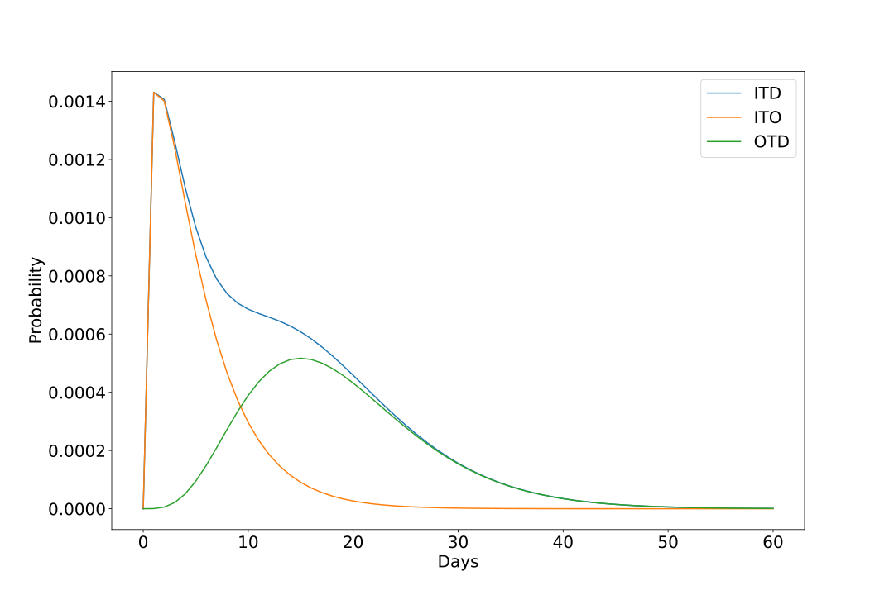
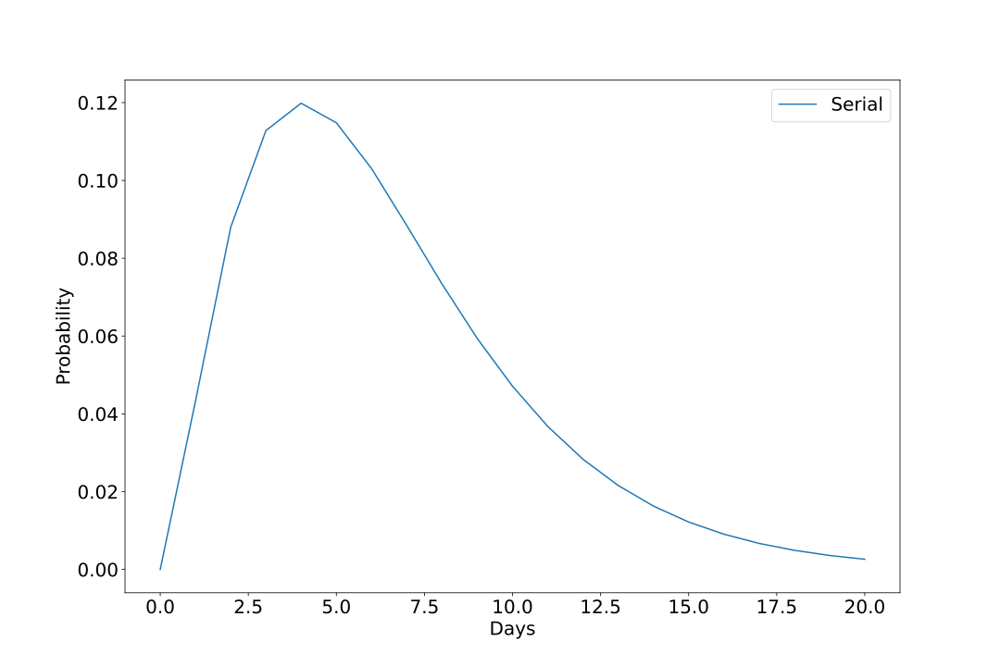
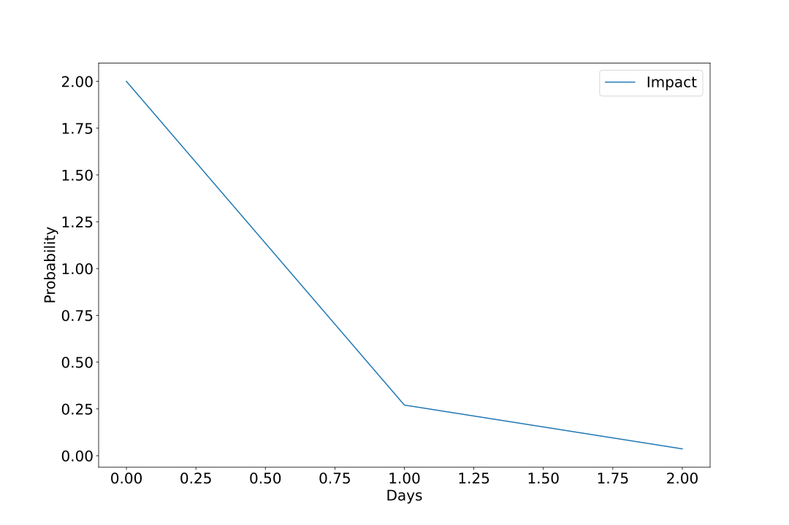
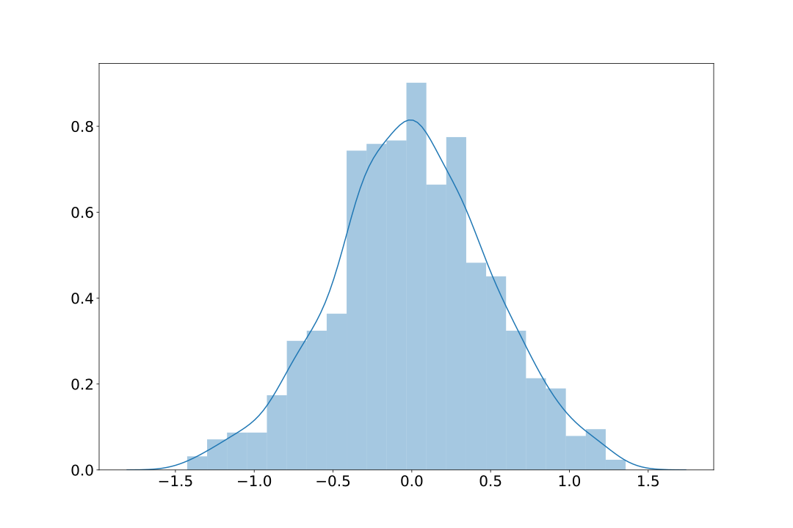
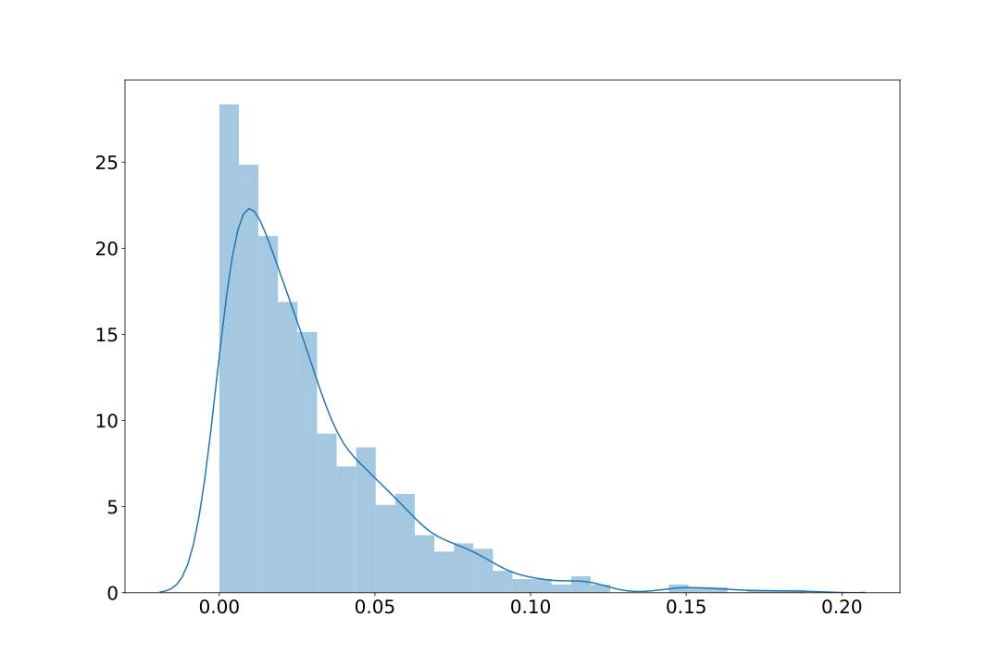
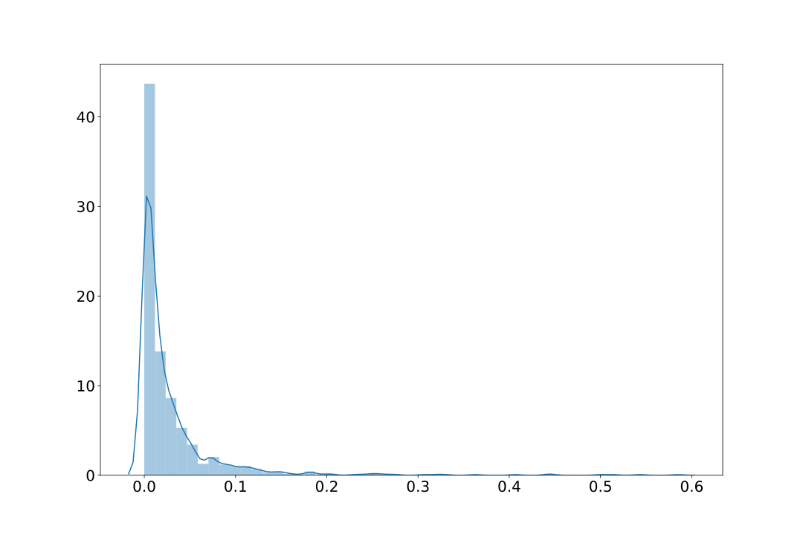

# Epidemic modeling

## R0 vs the final fraction infected

## Psi - half normal distribution (mean=0, std=5)

## Infection-to-onset: gamma(mean=5.1, variance=0.86)
shape (α) = 1/std^2

scale (β) = mean/shape = mean/(1/std^2) = mean*std^2

## Onset-to-death: gamma(18.8, 0.45)

## Infection-to-death
(infection fatality rate = 0.01)

## Survival Fraction for Infection-to-death

## Serial interval distribution
To model the number of infections over time we need to specify a serial
interval distribution g with density g(τ), (the time between when a person gets infected and when they subsequently infect another other people), which we choose to be Gamma distributed: g ∼ Gamma (6.5,0.62).

## Impact
The impact of each intervention on R t,m is characterised by a set of parameters
α 1 , ... , α 6 , with independent prior distributions chosen to be α k ∼ Gamma(0.5,1)

## R 0,m prior distribution
The prior distribution for R 0 was chosen to be R 0,m ∼ Normal(2.4, |κ|) with κ ∼ Normal(0,0.5)

Kappa

R0m

## Tau seed
We assume that seeding of new infections begins 30 days before the day after a country has cumulatively observed 10 deaths. From this date, we seed our model with 6 sequential days of infections drawn from c 1,m , ... , c 6,m ~Exponential(τ), where τ~Exponential(0.03).

Tau

Exponential(τ)

##ICL model for all 11 countries run with stan

