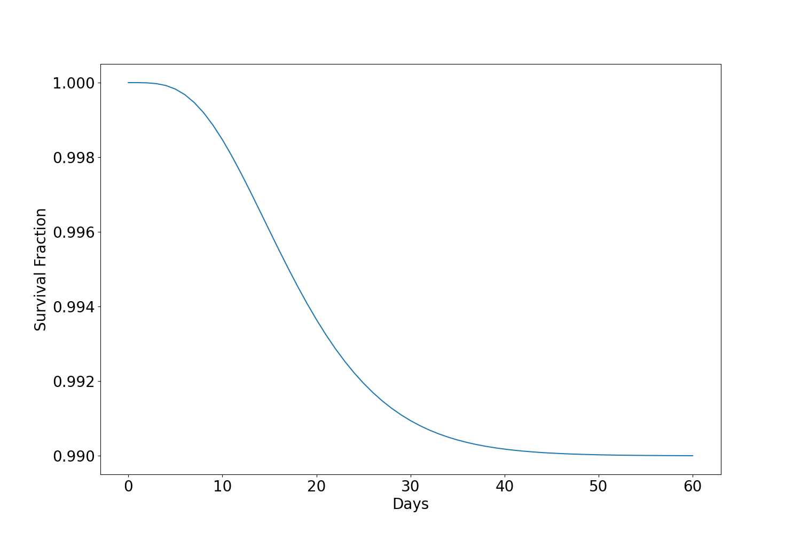

# Epidemic modeling

## R0 vs the final fraction infected

## Infection-to-onset: gamma(mean=5.1, variance=0.86)
shape (α) = 1/std^2

scale (β) = mean/shape = mean/(1/std^2) = mean*std^2

## Onset-to-death: gamma(18.8, 0.45)

## Survival Fraction for onset-to-death

## Infection-to-death

